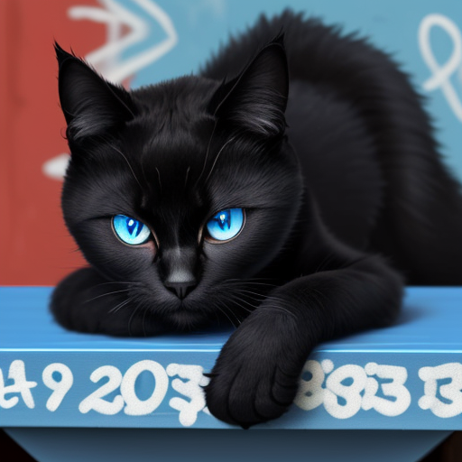
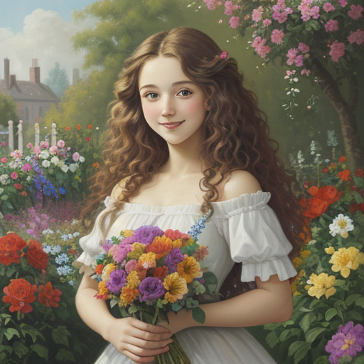
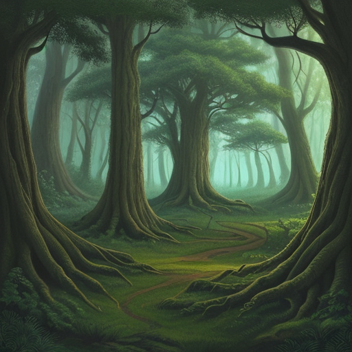
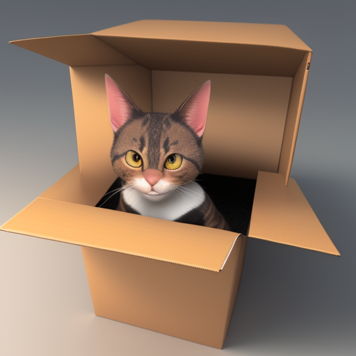
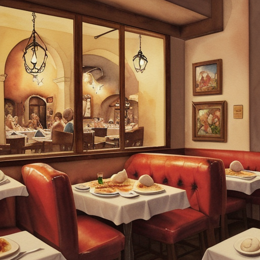
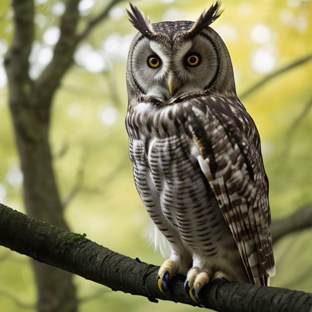
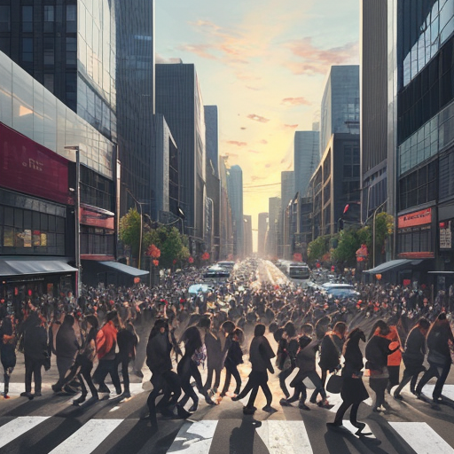

# Prompt Formula: Form of Artistic Representation

"Forms of artistic representation" refers to the different ways artists create and express their ideas. Ask yourself: do you want a photo, an oil painting, a graffiti, an illustration or a 3D rendering?

Our [ini prompt formula](./01-prompt-formula-subject.md#prompt-formula-subject) can now be extended to:

```markdown
<form of artistic representation><Adjective> Subject <Action or Accessory> <Location>
```

## Forms of Artistic Representation

There are numerous forms of artistic representation, and they vary based on the medium and techniques used by artists. Here are some common forms of artistic representation:

- **Painting:** This can include oil paintings, watercolors, acrylics, and more. 

- **Drawing:** This encompasses various drawing techniques, such as pencil, charcoal, or ink drawings. For instance, "ink drawing of a detailed portrait."

- **Illustration:** This often has a more whimsical or stylized quality. For example, "illustration of a fantasy creature."

- **3D-Render:** This involves creating three-dimensional art. You could request a "3D render of a famous historical figure."

- **Photograph:** This captures real-life moments. For example, "black and white photograph of a bustling city street."

- **Digital Art:** In the modern age, digital art is quite common. You might ask for a "digital art representation of a futuristic cityscape."

## Examples

| Prompt | Image | Prompt Breakdown |
| ------------------- | ----- | ------------------ |
| Oil painting of a cheerful young woman with long, curly hair holding a bouquet of colourful flowers in a garden


| Prompt | Image | Prompt Breakdown |
| ------------------- | ----- | ------------------ |
| Graffiti of a cute black cat with blue eyes wearing a red collar lying on a table |  | <ul><li><strong>Form of artistic representation:</strong> Graffiti</li><li><strong>Subject:</strong> cat</li><li><strong>Adjective:</strong> cute, black, with blue eyes</li><li><strong>Location:</strong> lying on a table</li><li><strong>Action or Accessory:</strong> wearing a red collar</li></ul> |
| Oil painting cheerful young woman with long, curly hair holding a bouquet of colorful flowers in a garden |  | <ul><li><strong>Form of artistic representation:</strong> Oil painting</li><li><strong>Subject:</strong> woman</li><li><strong>Adjective:</strong> cheerful, young, with long curly hair</li><li><strong>Location:</strong> in a garden</li><li><strong>Action or Accessory:</strong> holding a bouquet of colorful flowers</li></ul> |
| Illustration of an enchanted forest with ancient trees |  | <ul><li><strong>Form of artistic representation:</strong> Illustration</li><li><strong>Subject:</strong> Forest</li><li><strong>Adjective:</strong> Enchanted</li><li><strong>Location:</strong> Not specified</li><li><strong>Action or Accessory:</strong> Ancient trees</li></ul> |
| 3D render of a curious cat exploring a mysterious cardboard box |  | <ul><li><strong>Form of artistic representation:</strong> 3d render</li><li><strong>Subject:</strong> Cat</li><li><strong>Adjective:</strong> Curious</li><li><strong>Location:</strong> Not specified</li><li><strong>Action or Accessory:</strong> Exploring a mysterious cardboard box</li></ul> |
| Watercolor painting of a delicious pizza at a cozy Italian restaurant |  | <ul>li><strong>Form of artistic representation:</strong> Watercolor painting</li><li><strong>Subject:</strong> Pizza</li><li><strong>Adjective:</strong> Delicious</li><li><strong>Location:</strong> Cozy Italian restaurant</li><li><strong>Action or Accessory:</strong> Not specified</li></ul> |
| Photograph of an owl |  | <ul><li><strong>Form of artistic representation:</strong> Photograph</li><li><strong>Subject:</strong> Owl</li><li><strong>Adjective:</strong> Not specified</li><li><strong>Location:</strong> Not specified</li><li><strong>Action or Accessory:</strong> Not specified</li></ul> |
| Digital art representation of a busy city street, filled with rushing commuters |  | <ul><li><strong>Form of artistic representation:</strong> Digital art representation</li><li><strong>Subject:</strong> City street</li><li><strong>Adjective:</strong> Busy</li><li><strong>Location:</strong> Not specified</li><li><strong>Action or Accessory:</strong> Filled with rushing commuters</li></ul> |