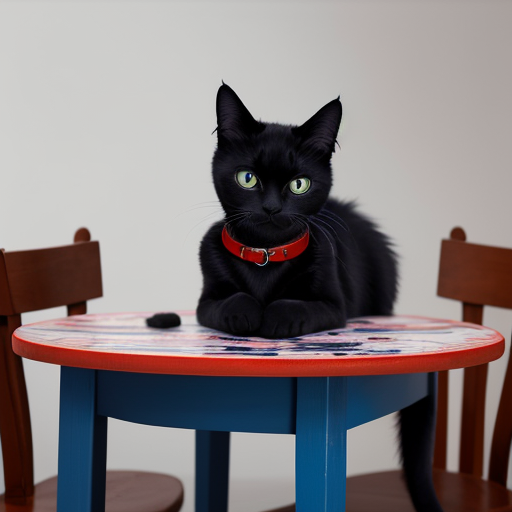
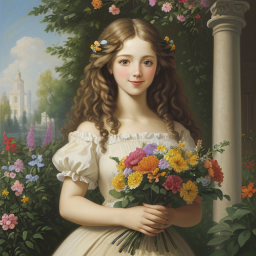
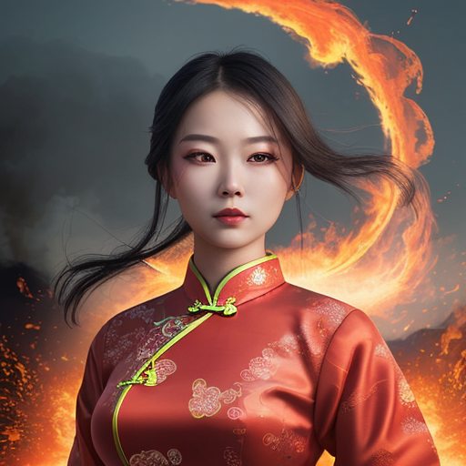

# Artistic Style

Style in art refers to an artist’s unique combination of techniques, processes, and
decisions. It refers to the distinctive way in which an image is represented.


Our prompt formula can now be extended to:

```markdown
<Artistic style><Artistic medium><Adjective> Subject <Action or Accessory> <Location>
```


Some popular example for artistic styles are:

- **Realism, Realistic style**: A focus on mimicking the appearance and nature of the subject. It is recognizable by fine rendering, muted colors, intricate detail, and accurate fundamentals.
- **Romanticism, Romantic style**: It means capturing the subject in a favorable and exaggerated style.
Art in the romantic style is characterized by sharp contrast, bright highlights, strong colors, and a refined, almost
glossy finish.
- **Abstract art**: A focus on capturing the subject in its simplest form. Think of abstract
as a scale rather than an absolute term. Essentially all artworks have some form of abstraction. Its characteristics are Reliance on shapes, colors, lines, and contrast.
- **Impressionism**: Captures the artist's impression of a subject. It is recognizable by light colors, weak shadows, energetic brushwork, broken color, and colorful accents.
- **Photorealism**: It means capturing the subject with photographic accuracy. Photorealism is an art movement that seeks to replicate the look of real-life photographs through another medium. Charecteristics are meticulous drawing and detail.
- **Surrealism**: Surrealism is an art movement that explores the bizarre and dreamlike, creating images that defy reality and logic. It often features unexpected combinations, distorted forms, and a focus on the subconscious mind. Salvador Dalí and René Magritte are notable surrealistic artists.
- **Pop Art**: Pop art was a Western art movement that was popularized in The United States and Great Britain in the 1950s. Pop art – known for its bright, attention-catching colors – was used in advertising, merchandising, and graphic design during an era of rapid consumer growth.
- **Hyperrealism**: Hyperrealism is an art style that creates extremely realistic artworks, often indistinguishable from high-resolution photographs. Artists meticulously capture details to achieve a heightened level of realism.


## Examples


| Prompt | Image | Prompt Breakdown |
| ------------------- | ----- | ------------------ |
| Abstract art of a cute black cat with blue eyes wearing a red collar lying on a table |  | <ul><li><strong>Artistic medium:</strong> Not Specified</li><li><strong>Subject:</strong> cat</li><li><strong>Adjective:</strong> cute, black, with blue eyes</li><li><strong>Location:</strong> lying on a table</li><li><strong>Action or Accessory:</strong> wearing a red collar</li><li><strong>Artistic style:</strong> Abstract art</li></ul> |
| Oil painting of a cheerful young woman with long, curly hair holding a bouquet of colorful flowers in a garden, , in the style of classicism |  | <ul><li><strong>Artistic medium:</strong> Oil painting</li><li><strong>Subject:</strong> woman</li><li><strong>Adjective:</strong> cheerful, young, with long curly hair</li><li><strong>Location:</strong> in a garden</li><li><strong>Action or Accessory:</strong> holding a bouquet of colorful flowers</li><li><strong>Style:</strong> in the style of classicism</li></ul> |
| Hyperrealistic portrait of a beautiful woman wearing traditional dress qipao, floating in air with electricity surrounding, electricity in eyes, fire in background. Photograph |  | <ul><li><strong>Artistic medium:</strong> Photograph</li><li><strong>Subject:</strong> Woman</li><li><strong>Adjective:</strong> Beautiful, wearing traditional dress qipao, electricity in eyes</li><li><strong>Location:</strong> Fire in background</li><li><strong>Action or Accessory:</strong> Floating in air with electricity surrounding </li><li><strong>Style:</strong> Hyperrealistic</li></ul></ul> |