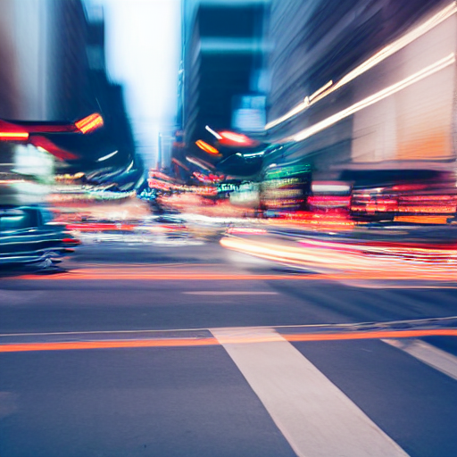

# Aesthetics

Aesthetics involve the visual appeal and style of an artwork, including choices in composition, color, form, and overall design. It explores the harmonious integration of elements to evoke emotions, convey messages, and create a visually pleasing experience for the viewer.

Our prompt formula can now be extended to:

```markdown
<Artistic medium> <Adjective> Subject <Action or Accessory> <Location> Artistic style> <Aesthetics>
```

Let's break down some of the aesthetic elements that can impact image generation.

## Perspective
The perspective refers to the vantage point or viewpoint from which an image is observed or created. Here are some examples:

- **Linear Perspective:**
  - *Example:* A road that appears to converge into the distance, with parallel lines meeting at a vanishing point, creating a sense of depth.

- **Aerial Perspective (Atmospheric Perspective):**
  - *Example:* Mountains in the distance appearing lighter in color and less detailed due to atmospheric effects, conveying a sense of distance.

- **Fish-Eye Perspective:**
  - *Example:* Using a fish-eye lens to capture a scene, resulting in a distorted, spherical view that includes a wide field of view.

- **Worm's Eye View:**
  - *Example:* Photographing or painting a subject from a low angle, as if seen from the ground, exaggerating the height and dominance of the subject.

- **Bird's Eye View:**
  - *Example:* Capturing a scene from a high angle, as if seen from above, providing an overview and emphasizing patterns or relationships between elements.

- **Multiple Perspectives (Cubism):**
  - *Example:* Picasso's [Les Demoiselles d'Avignon](https://en.wikipedia.org/wiki/Les_Demoiselles_d%27Avignon), where he portrays multiple viewpoints of the figures simultaneously, breaking away from a single, fixed perspective.

## Exposure (Photography)

Exposure in photography is the amount of light reaching the camera sensor. It's controlled by adjusting the shutter speed, aperture, and ISO. Finding the right balance ensures a well-lit and detailed image. Here are some examples:

- **Correct Exposure:**
   - *Example:* A well-balanced photograph with accurate representation of shadows, highlights, and mid-tones, providing a natural and realistic appearance.

- **Overexposure:**
   - *Example:* A photograph where too much light reaches the camera sensor, resulting in washed-out highlights, loss of detail, and a generally brighter image.

- **Underexposure:**
   - *Example:* A photograph with insufficient light, leading to darker shadows, loss of detail in the shadows, and reduced visibility of darker elements in the scene.

- **High Key Lighting:**
   - *Example:* A deliberately bright and evenly lit photograph, often used in portrait photography, where the emphasis is on a well-lit subject against a bright background.

- **Low Key Lighting:**
   - *Example:* A photograph intentionally underexposed, creating strong contrasts between light and shadow, often used to evoke a moody or dramatic atmosphere.

- **Long Exposure:**
   - *Example:* A photograph taken with a slow shutter speed, capturing motion blur in moving subjects or creating a smooth, flowing effect in water or clouds.

## Light

Lighting in images, whether in photography or paintings, refers to the deliberate use and manipulation of light to enhance visual impact. It shapes the mood, highlights details, and influences the overall atmosphere, contributing to the effectiveness and emotional resonance of the image. In paintings, artists use brushwork and color to simulate the effects of light, while in photography, the control of natural and artificial light sources is essential for achieving the desired aesthetic. These are some examples:

- **Natural Light:**
  - *Example:* Illuminating a subject using ambient sunlight, providing a soft and natural look, often ideal for portraits taken outdoors.

- **Backlighting:**
  - *Example:* Positioning the light source behind the subject, creating a halo effect and emphasizing contours, often used for creating silhouettes.

- **Soft Light:**
  - *Example:* Achieving a gentle and diffused illumination, commonly from overcast skies or through a diffuser, resulting in soft shadows and even tones.

- **Hard Light:**
  - *Example:* Using a direct and intense light source, such as the sun or a spotlight, to create strong, defined shadows and highlights.

- **Rim Lighting:**
  - *Example:* Illuminating the edges of a subject from behind, creating a glowing outline and separating the subject from the background.

- **Rembrandt Lighting:**
  - *Example:* Creating a triangular highlight on the cheek of the subject, often achieved with a single light source at a specific angle, evoking a classic and dramatic look.


## Textures

Texture in images, found in both paintings and photography, is the tactile quality conveyed visually. Examples include the rough texture of weathered wood in a photograph, or the skillful brushstrokes creating the illusion of soft fur in a painting. Texture adds depth, evoking sensations and enriching the viewer's visual experience. Some examples are:

- **Rough Texture:**
  - *Example:* A photograph capturing the coarse and weathered surface of aged stone walls, or a painting with pronounced brushstrokes creating a rugged appearance.

- **Smooth Texture:**
  - *Example:* A close-up photograph of a calm body of water with a glassy surface, or a painting depicting a polished marble statue with a smooth finish.

- **Soft Texture:**
  - *Example:* A photograph showcasing the gentle, fluffy texture of clouds during a sunset, or a painting illustrating the velvety petals of a flower.

- **Prickly Texture:**
  - *Example:* A macro photograph revealing the spiky texture of a cactus, or a painting portraying the thorny exterior of a rose stem.

- **Furry Texture:**
  - *Example:* A detailed photograph highlighting the soft and furry texture of an animal's coat, or a painting with meticulously layered brushstrokes simulating fur.

- **Textured Fabric:**
  - *Example:* A photograph showcasing the intricate texture of woven fabric, or a painting depicting the tactile quality of draped clothing through skillful detailing.

## Contrast

Contrast in images is the degree of difference between elements, such as light and dark, colors, or textures. It adds visual interest, emphasizes focal points, and creates a dynamic composition. Here are some examples:

- **High Contrast:**
  - *Example:* A photograph with stark black and white elements, creating strong visual impact and emphasizing sharp distinctions.

- **Low Contrast:**
  - *Example:* A painting with muted tones and subtle transitions between light and shadow, creating a softer and more subdued visual effect.

- **Color Contrast:**
  - *Example:* A photograph featuring vibrant red flowers against a green background, creating a striking color contrast that draws attention.

- **Texture Contrast:**
  - *Example:* A close-up photograph showcasing the juxtaposition of smooth and rough textures, adding tactile interest and visual variety.

- **Size Contrast:**
  - *Example:* A painting with a small, detailed subject against a large, simple background, creating a sense of scale and visual hierarchy.


| Prompt | Image | Prompt Breakdown |
| ------------------- | ----- | ------------------ |
| photo of a busy city street with cars passing buy, long exposure |  | <ul><li><strong>Subject:</strong> City street </li><li><strong>Adjective:</strong> Busy </li><li><strong>Location:</strong> Not specified </li><li><strong>Action or Accessory:</strong> With cars passing by </li><li><strong>Artistic medium:</strong> Photo </li><li><strong>Artistic style:</strong> Not specified </li><li><strong>Aesthetics:</strong> Long exposure </li></ul> |
| photo of a busy city street with cars passing buy, long exposure |  | <ul><li><strong>Subject:</strong> City street </li><li><strong>Adjective:</strong> Busy </li><li><strong>Location:</strong> Not specified </li><li><strong>Action or Accessory:</strong> With cars passing by </li><li><strong>Artistic medium:</strong> Photo </li><li><strong>Artistic style:</strong> Not specified </li><li><strong>Aesthetics:</strong> Long exposure </li></ul> |

