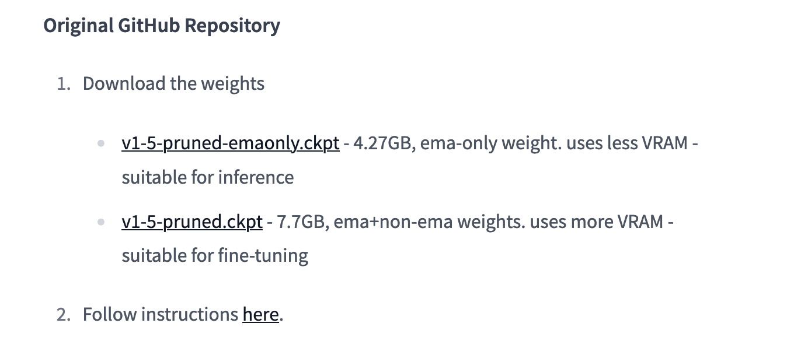
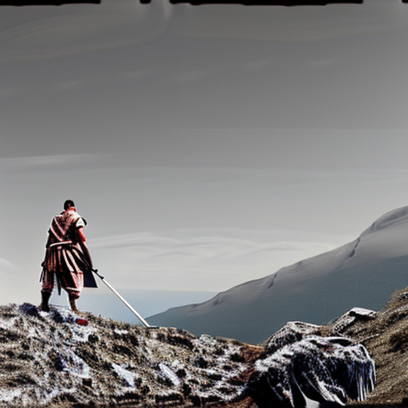

# Overview of Stable Diffusion Models

## Where to find Stable Diffusion Models

The most popular places to find and download models are [Civitai](https://civitai.com/) and [Hugging Face](https://huggingface.co/). 

## How to use Stable Diffusion Models

### Downloading a Model
Dowload the model according to the download instruction on the model page. Usually, there is a download instruction on each page. It looks like this: 

Downloading a model means downloading a checkpoint file. These files have file-ending `.ckpt` or `.safetensors`.

> For some models, like Stable Diffusion 2.0 and 2.1, you must also download a configuration file and to be able to use it in [AUTOMATIC1111's Stable Diffusion Web UI](https://github.com/AUTOMATIC1111/stable-diffusion-webui#stable-diffusion-web-ui). You must also change the filename of the configuration file (which is a `.yml` file) to the filename of the model. So for model file `v2-1_768-ema-pruned.ckpt`, you must rename the configuration file to `v2-1_768-ema-pruned.yml` and put both files in the [model folder](sd-installation-guide.md#download-the-model) for Stable Diffusion Web UI. You can download the configuration file from [here](https://github.com/Stability-AI/stablediffusion/raw/main/configs/stable-diffusion/v2-inference-v.yaml).

### Using the Model
To use the model, you will need a graphical user inteface (GUI). I recommend Stable Diffusion Web UI from Automatic 1111. You will find installation instructions [here](stable-diffusion-webui-installation-guide.md)

## Which Stable Diffusion Model is the Best?

There is no *best model*. There are different models for different purposes. Some models were trained on anime art, some on photographs, etc. 

For beginners, I recommend starting with [stable-diffusion-v1-5](https://huggingface.co/runwayml/stable-diffusion-v1-5). Once you mastered working with Stable Diffusion, you can move on to other models.

## Some Popular Stable Diffusion Models

These are some of the models that I have been using.

| Model |  Best for | Example |
| ----- | --------- | ------- |
|[stable-diffusion-v1-5](https://huggingface.co/runwayml/stable-diffusion-v1-5)| The basic Stable Diffusion model for beginners ||
|[Stable Diffusion 2.0](https://huggingface.co/stabilityai/stable-diffusion-2)| The official Stability AI model, was poorly received and improved with version 2.1 ||
|[Stable Diffusion 2.1](https://huggingface.co/stabilityai/stable-diffusion-2-1)| Allrounder, Stability AI's improvement on version 2.0 ||
|[Anything v3](https://huggingface.co/Linaqruf/anything-v3.0)| The go-to model for anime art||
|[Realistic Vision V2.0](https://civitai.com/models/4201/realistic-vision-v20)| produces realistic but not photorealistic images that match the text prompt. It can be used for creating landscapes, portraits, animals, objects, etc. ||
|[Dreamshaper](https://civitai.com/models/4384/dreamshaper)| creates beautiful digital art with an illustration style. It can be used for creating fantasy scenes, abstract art, surreal images, etc. ||
