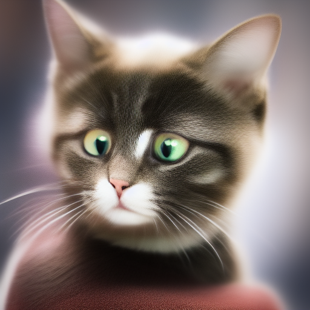
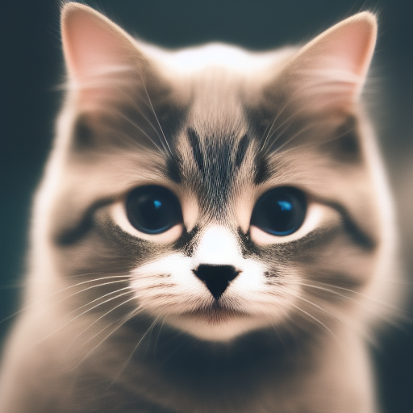

# Comparison of Stable Diffusion Sampling Methods

## Configuration
* Model [v1-5-pruned-emaonly.ckpt](https://huggingface.co/runwayml/stable-diffusion-v1-5/resolve/main/v1-5-pruned-emaonly.ckpt)
* positive prompt: "profile photo fof a cute cat"
* No negative prompt
* CFG scale 7
* Seed 2961182060

# Comparison

| Sampler / Steps | &nbsp; &nbsp; &nbsp; &nbsp; &nbsp; &nbsp; 1 &nbsp; &nbsp; &nbsp; &nbsp; &nbsp; &nbsp; | 5 | 10 | 15 | 20 | 25 | 30 | 35 | 40 | 45 | 50 | 55 | 60 |
| --------------- | - | -- | -- | -- | -- | -- | -- | -- | -- | -- | -- | -- | -- |
| Euler a |  |  |  |  |  |  |  |  |  |  |  |  |  |
