# Comparison of Stable Diffusion Sampling Methods

## Configuration
* Model [v1-5-pruned-emaonly.ckpt](https://huggingface.co/runwayml/stable-diffusion-v1-5/resolve/main/v1-5-pruned-emaonly.ckpt)
* positive prompt: "profile photo of a cute cat"
* No negative prompt
* CFG scale 7
* Seed 2961182060

# Comparison

| Sampler | 1   Step | 5   Steps | 10   Steps | 15   Steps | 20   Steps | 25   Steps | 30   Steps | 35   Steps | 40   Steps | 45   Steps | 50   Steps | 55   Steps | 60   Steps|
| - | - | - | -| - | - | - | - | - | - | - | - | - | - |
| Euler a |  |  |  |  |  |  |  |  |  |  |  |  |  |
| Euler |  |  |  |  |  |  |  |  |  |  |  |  |  |
| LMS |  |  |  |  |  |  |  |  |  |  |  |  |  |
| Heun | |  |  |  |  |  |  |  |  |  |  |  |  |
| DPM2 | |  |  |  |  |  |  |  |  |  |  |  |  | 
| DPM2 a | |  |  |  |  |  |  |  |  |  |  |  |  | 
| DPM++ 2S a | | 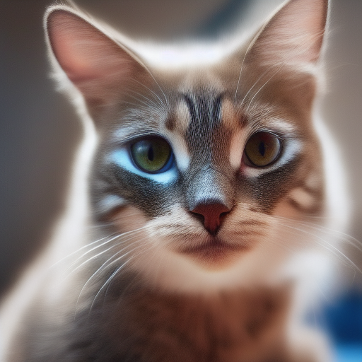 |  |  |  |  |  |  |  |  |  |  |  | 
| DPM++ 2M | |  |  |  |  |  |  |  |  |  |  |  |  | 
| DPM++ SDE | |  |  |  |  |  |  |  |  |  |  |  |  | 
| DPM fast | |  |  | 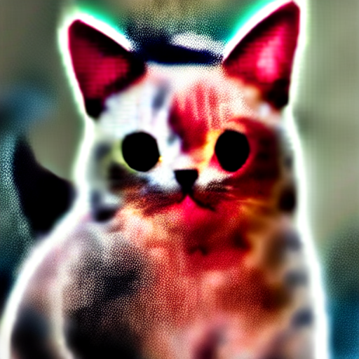 |  | 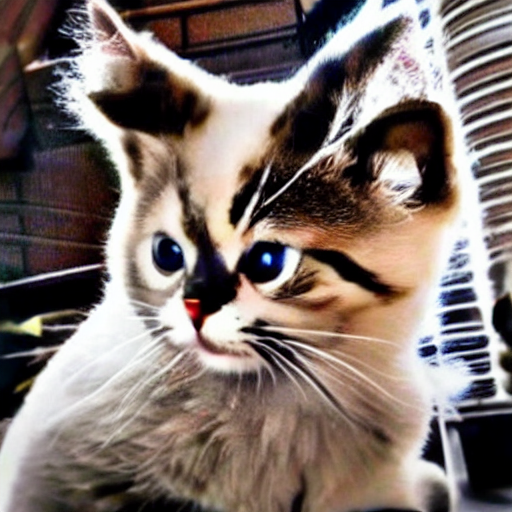 | 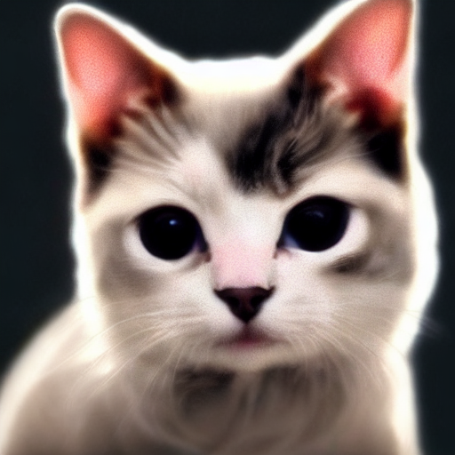 |  | 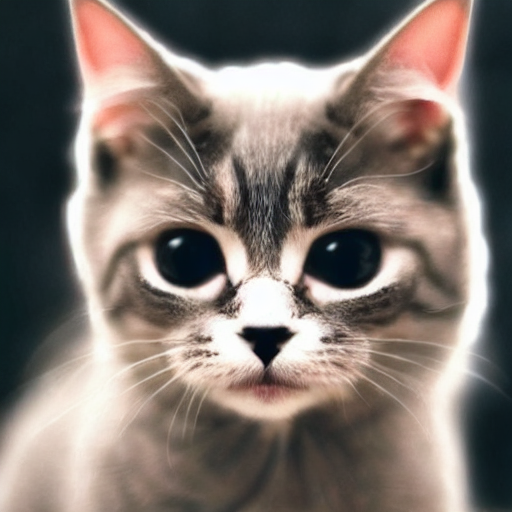 |  |  |  |  | 
| DPM adaptive | |  |  |  |  |  |  |  |  |  |  |  |  | 
| LMS Karras | |  |  |  |  |  |  |  |  |  |  |  |  | 
| DPMS2 Karras | |  |  |  |  |  |  |  |  |  |  |  |  | 
| DPM2 a Karras | |  |  |  |  |  |  |  |  |  |  |  |  | 
| DPM++ 2S a Karras | |  | 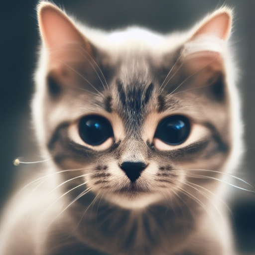 |  |  |  |  |  |  |  |  |  |  | 
| DPM++ 2M Karras | |  |  |  |  |  |  |  |  |  |  |  |  | 
| DPM++ SDE Karras | |  |  |  |  |  |  |  |  |  |  |  |  | 
| DDIM | 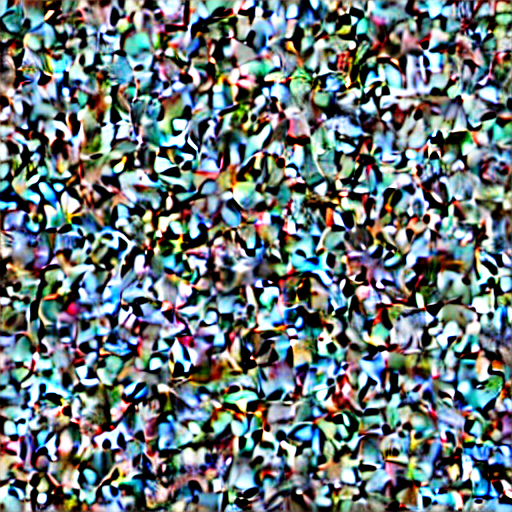| 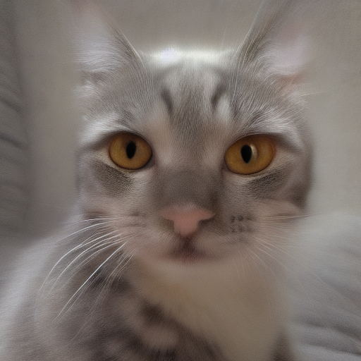 | 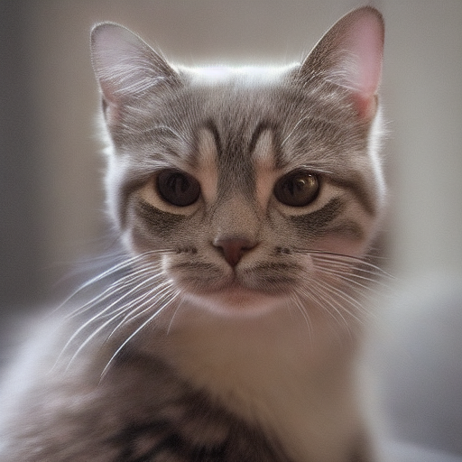 |  |  |  |  |  |  |  |  |  |  | 
| PLMS | | 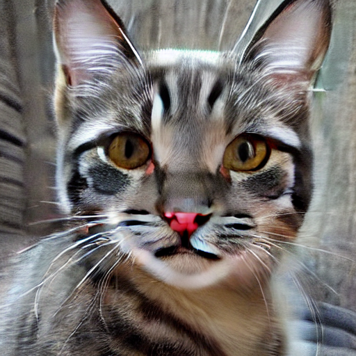 | 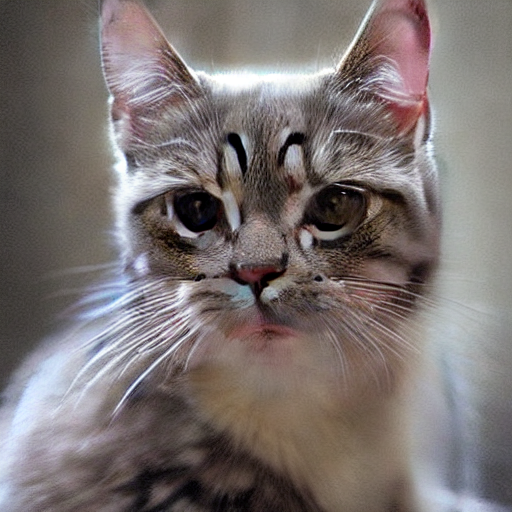 |  |  |  |  |  |  |  |  |  |  | 
| UniPC | 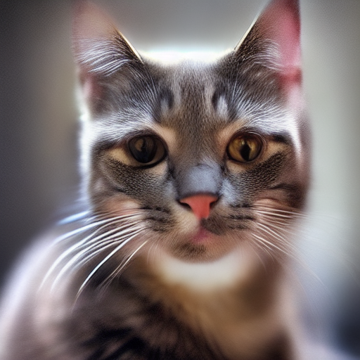| 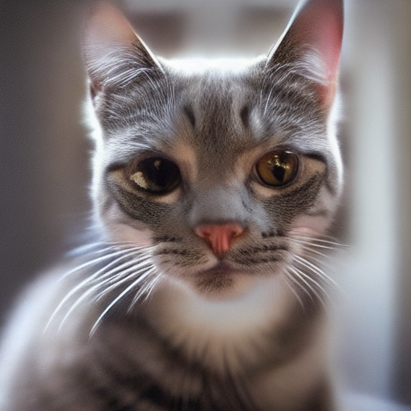 |  |  |  |  |  |  |  |  |  |  |  | 